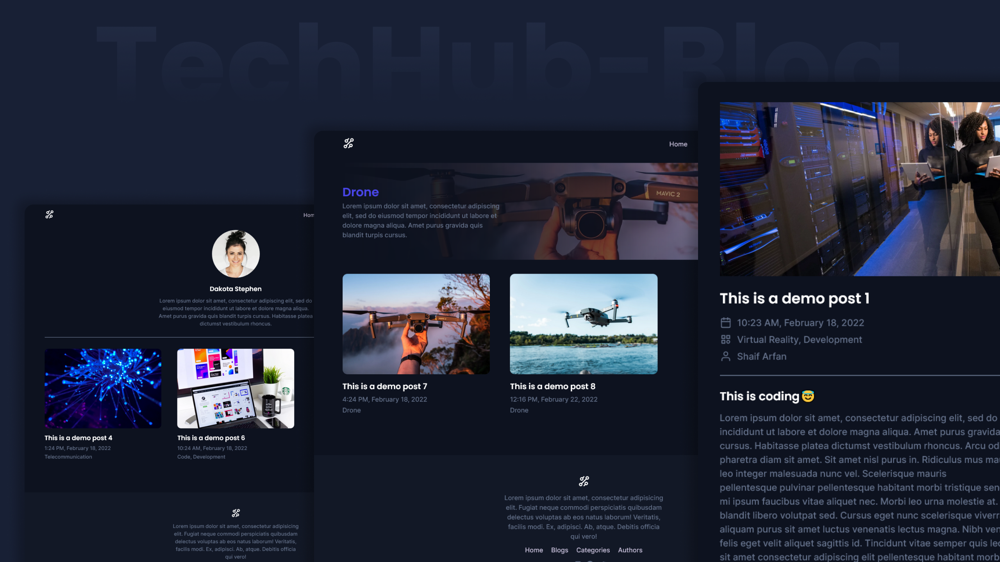

# Space-Hub

A complete blog that im creating  with `JAMstack`. ([Gatsby.js](https://www.gatsbyjs.org/) & [Sanity.io](https://sanity.io)).

---

## Project Details

Space-Hub is a complete tech blog website. Here we will see three post types: `blogs`, `categories`, and `authors`. We will create relations between these three post types. So that we can create a blog post with a category and an author. Also we will make a `search feature` where we can search against all these three post types.

To create this website I will use `JAMstack`. We will use `Gatsby.js` for the frontend and `Sanity.io` for the headless CMS. And to source our content  using `graphql`.

