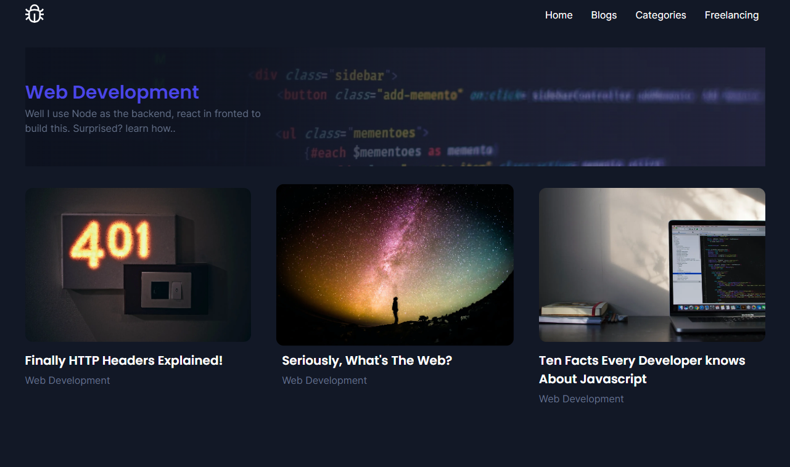

# Space-Hub

A complete blog that I'm creating  with `JAMstack`.
---

## Details
Space-Hub is a complete tech blog website. Here you can see three post types: `blogs`, `categories`, and `authors`. Relations between these three post types. 
To create this website I'm using `JAMstack`. 
Gatsby.js` for the frontend and 
`Sanity.io` for the headless CMS. And to source the content  using `graphql`.

